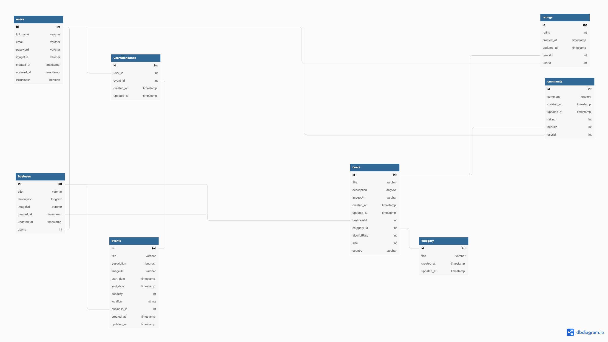

## Welcome to Beer Boutique.

This is an App made as part of my final Project as a Student in Coddaiseur Coding BootCamp.
This is a project made in 10 days from scratch using no templates or previous code.

---

## The idea behind the Beer Boutique.

The need in the market for an easy to use Events App has never been bigger.
I know that from experience and since now i have the tools i took the liberty to start a small revolution by making a new easy to use, friendly and FREE App for small Bars and Breweries.

---

**Languages and Tools:**

<code></code>
<code></code>
<code></code>
<code></code>
<code></code>

---

👇 **Click links to see code samples in this project** 👇

- [React](https://github.com/Vasileios1314/beer_boutique_frontend/blob/master/src/App.js) ⭐
- [Redux for state management](https://github.com/Vasileios1314/beer_boutique_frontend/tree/master/src/store) ⭐
- [Authentication](https://github.com/Vasileios1314/beer_boutique_backend/tree/master/auth)
- [Express as web app framework](https://github.com/Vasileios1314/beer_boutique_backend/blob/master/index.js)
  - [REST API](https://github.com/Vasileios1314/beer_boutique_backend/tree/master/routers)
- [Sequelize as ORM](https://github.com/Vasileios1314/beer_boutique_backend/tree/master/models)
- [Many-to-many models](https://github.com/Vasileios1314/beer_boutique_backend/tree/master/models) ⭐

⭐ _New technology learned during this project_

---

## App Quick OverView

---

## Project Board

Check the project's state and the future of it [project board](https://github.com/users/Vasileios1314/projects/1)

---

## Wireframes

---

## Database Diagram

---

## Backend server repo

The backend side of this project is an Express server using Sequelize. [Click here for more details](https://github.com/Vasileios1314/beer_boutique_backend)

---

## Wrapping it up

**A final overview...:**

- 👨🏽‍💻 I worked endless hours the past week to deliver this project at the currient state. The idea was above and beyond my level of coding at the time i started, but hard work and lot of study delivered a piece of my overal idea which is very presentable and i am very proud of it!
- 💬 Ask me about anything about the project, I am happy to chat with people or even colaborate.
- 📫 How to reach me: [vasileios.bobonis@gmail.com](https://www.linkedin.com/in/vasileios-bomponis-a20673121/);
- 📝 That is my : [LinkedIn](https://www.linkedin.com/in/vasileios-bomponis-a20673121/)
